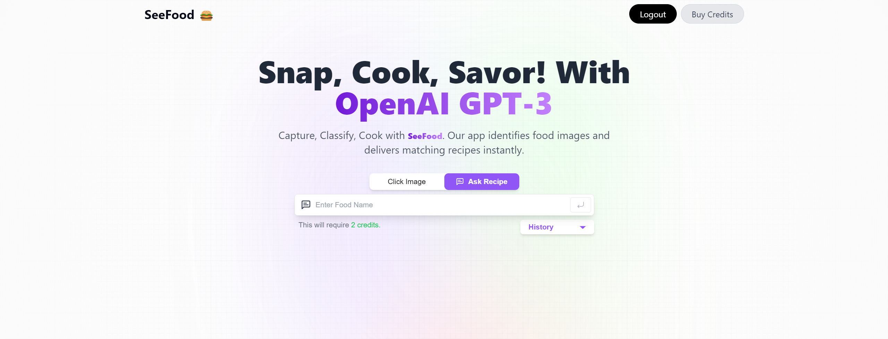
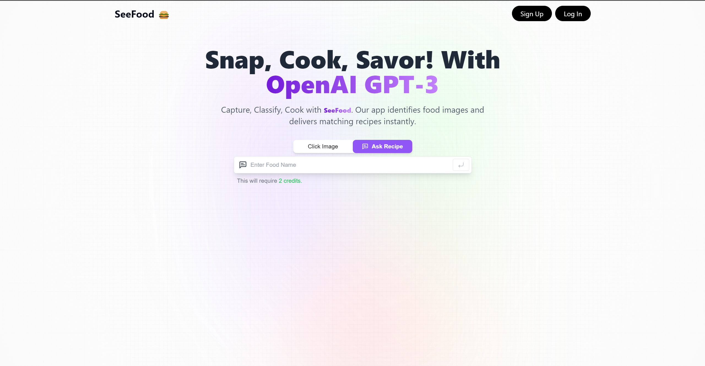
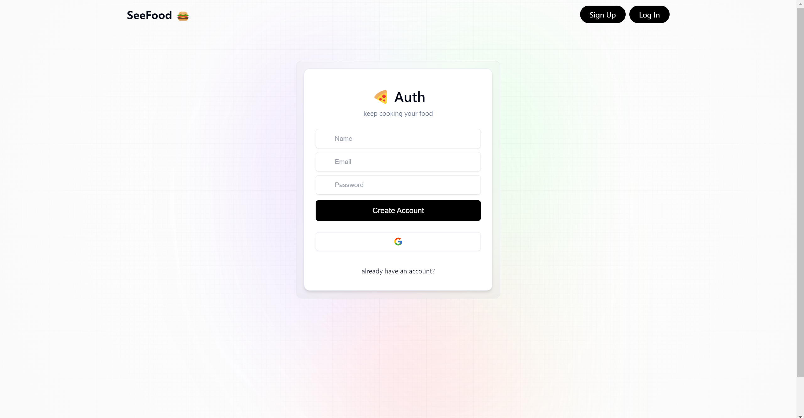
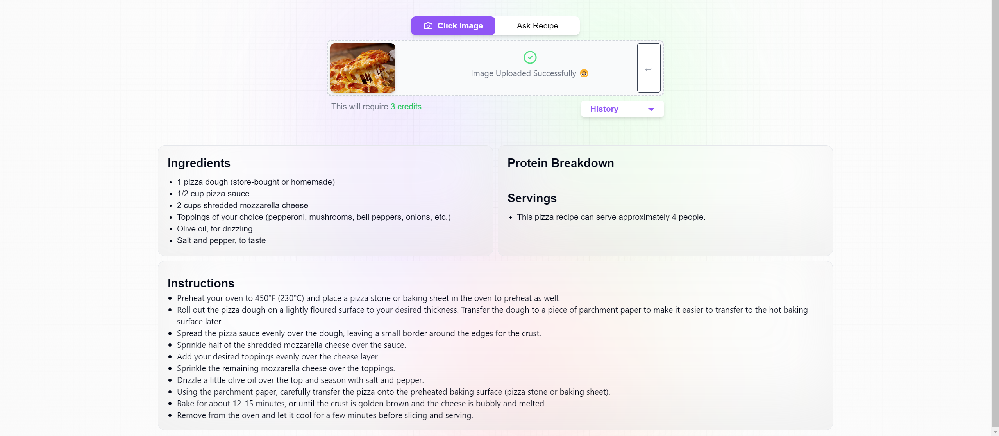
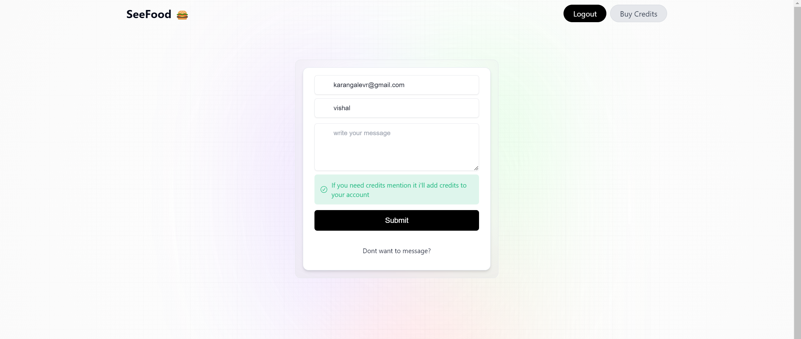
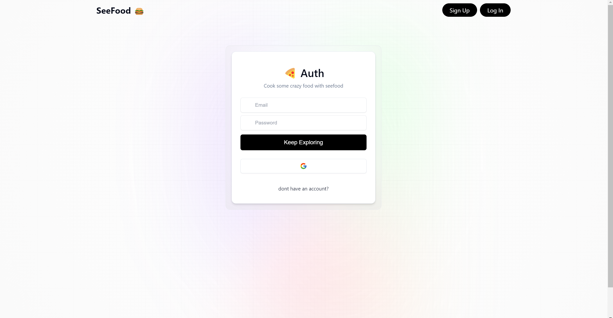
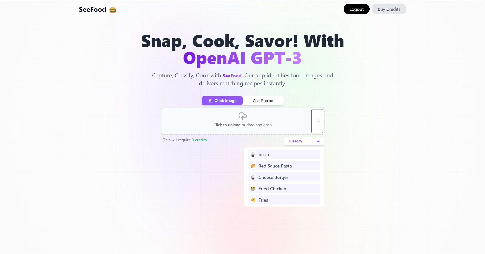
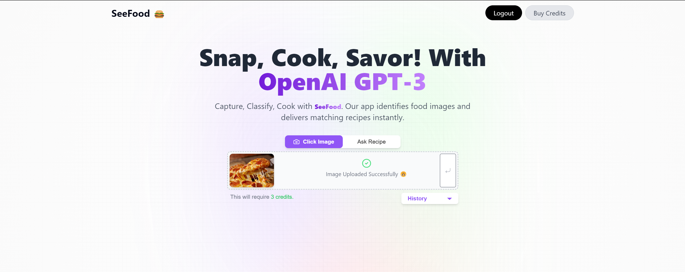

# SeeFood.ai
an web App to classify food dishes and then to disply recipe of that food

## Tech Stack
- React JS
- Typescript
- Firebase
- Tailwind CSS
- Open AI
- Redux Toolkit
- Framer Motion
- EmailJS

## Features
- Image Classification
- Recipe Generation
- User Authentication
- User Profile
- User History
- Error Handling
- Mobile Support

## Deployment
- Firebase Hosting
- Vercel Cloud Functions

# Screenshots

## Contact Me

    <a href="https://github.com/vishalrk1" target="_blank">
        &nbsp;
    </a>
    <a href="https://www.linkedin.com/in/vishal-karangale-126492216/" target="_blank">
        &nbsp;
    </a>
     <a href="https://www.instagram.com/vishal_rk1/" target="_blank">
       &nbsp;
    </a>

